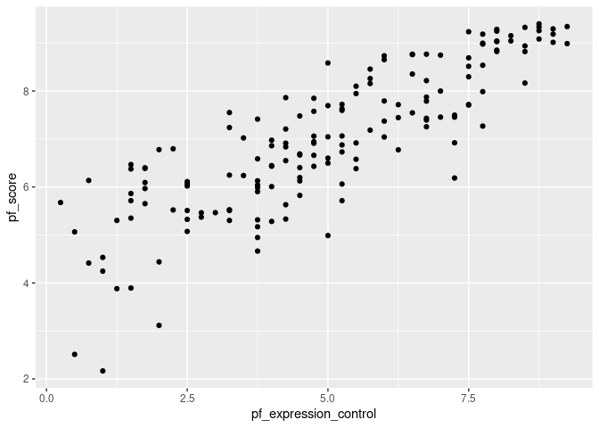
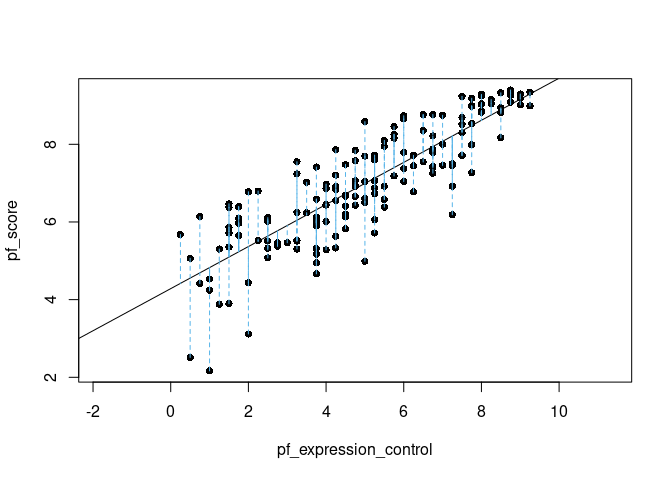
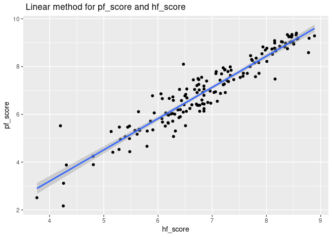

Activity 2 - Day 1
================

## Task 2: Loading required Packages

``` r
# Loading required packages
library(tidyverse)
```

    ## ── Attaching packages ─────────────────────────────────────── tidyverse 1.3.2 ──
    ## ✔ ggplot2 3.3.6     ✔ purrr   0.3.4
    ## ✔ tibble  3.1.8     ✔ dplyr   1.0.9
    ## ✔ tidyr   1.2.0     ✔ stringr 1.4.1
    ## ✔ readr   2.1.2     ✔ forcats 0.5.2
    ## ── Conflicts ────────────────────────────────────────── tidyverse_conflicts() ──
    ## ✖ dplyr::filter() masks stats::filter()
    ## ✖ dplyr::lag()    masks stats::lag()

``` r
library(tidymodels)
```

    ## ── Attaching packages ────────────────────────────────────── tidymodels 1.0.0 ──
    ## ✔ broom        1.0.0     ✔ rsample      1.1.0
    ## ✔ dials        1.0.0     ✔ tune         1.0.0
    ## ✔ infer        1.0.3     ✔ workflows    1.0.0
    ## ✔ modeldata    1.0.0     ✔ workflowsets 1.0.0
    ## ✔ parsnip      1.0.1     ✔ yardstick    1.0.0
    ## ✔ recipes      1.0.1     
    ## ── Conflicts ───────────────────────────────────────── tidymodels_conflicts() ──
    ## ✖ scales::discard() masks purrr::discard()
    ## ✖ dplyr::filter()   masks stats::filter()
    ## ✖ recipes::fixed()  masks stringr::fixed()
    ## ✖ dplyr::lag()      masks stats::lag()
    ## ✖ yardstick::spec() masks readr::spec()
    ## ✖ recipes::step()   masks stats::step()
    ## • Use suppressPackageStartupMessages() to eliminate package startup messages

``` r
library(ggplot2)
```

## Task 3: Reading the dataset from URL

``` r
hfi <- readr::read_csv("https://www.openintro.org/data/csv/hfi.csv")
```

    ## Rows: 1458 Columns: 123
    ## ── Column specification ────────────────────────────────────────────────────────
    ## Delimiter: ","
    ## chr   (3): ISO_code, countries, region
    ## dbl (120): year, pf_rol_procedural, pf_rol_civil, pf_rol_criminal, pf_rol, p...
    ## 
    ## ℹ Use `spec()` to retrieve the full column specification for this data.
    ## ℹ Specify the column types or set `show_col_types = FALSE` to quiet this message.

``` r
hfi
```

    ## # A tibble: 1,458 × 123
    ##     year ISO_code countr…¹ region pf_ro…² pf_ro…³ pf_ro…⁴ pf_rol pf_ss…⁵ pf_ss…⁶
    ##    <dbl> <chr>    <chr>    <chr>    <dbl>   <dbl>   <dbl>  <dbl>   <dbl>   <dbl>
    ##  1  2016 ALB      Albania  Easte…    6.66    4.55    4.67   5.29    8.92      10
    ##  2  2016 DZA      Algeria  Middl…   NA      NA      NA      3.82    9.46      10
    ##  3  2016 AGO      Angola   Sub-S…   NA      NA      NA      3.45    8.06       5
    ##  4  2016 ARG      Argenti… Latin…    7.10    5.79    4.34   5.74    7.62      10
    ##  5  2016 ARM      Armenia  Cauca…   NA      NA      NA      5.00    8.81      10
    ##  6  2016 AUS      Austral… Ocean…    8.44    7.53    7.36   7.78    9.62      10
    ##  7  2016 AUT      Austria  Weste…    8.97    7.87    7.67   8.17    9.74      10
    ##  8  2016 AZE      Azerbai… Cauca…   NA      NA      NA      4.27    9.14      10
    ##  9  2016 BHS      Bahamas  Latin…    6.93    6.01    6.26   6.40    0         10
    ## 10  2016 BHR      Bahrain  Middl…   NA      NA      NA      5.90    9.79      10
    ## # … with 1,448 more rows, 113 more variables:
    ## #   pf_ss_disappearances_violent <dbl>, pf_ss_disappearances_organized <dbl>,
    ## #   pf_ss_disappearances_fatalities <dbl>, pf_ss_disappearances_injuries <dbl>,
    ## #   pf_ss_disappearances <dbl>, pf_ss_women_fgm <dbl>,
    ## #   pf_ss_women_missing <dbl>, pf_ss_women_inheritance_widows <dbl>,
    ## #   pf_ss_women_inheritance_daughters <dbl>, pf_ss_women_inheritance <dbl>,
    ## #   pf_ss_women <dbl>, pf_ss <dbl>, pf_movement_domestic <dbl>, …

1.  From the dataset I could find that dimensions are **1458 X 123**.
    Each row represents data for each country.

``` r
hfi_2016 <- hfi %>% filter(year == 2016)

hfi_2016
```

    ## # A tibble: 162 × 123
    ##     year ISO_code countr…¹ region pf_ro…² pf_ro…³ pf_ro…⁴ pf_rol pf_ss…⁵ pf_ss…⁶
    ##    <dbl> <chr>    <chr>    <chr>    <dbl>   <dbl>   <dbl>  <dbl>   <dbl>   <dbl>
    ##  1  2016 ALB      Albania  Easte…    6.66    4.55    4.67   5.29    8.92      10
    ##  2  2016 DZA      Algeria  Middl…   NA      NA      NA      3.82    9.46      10
    ##  3  2016 AGO      Angola   Sub-S…   NA      NA      NA      3.45    8.06       5
    ##  4  2016 ARG      Argenti… Latin…    7.10    5.79    4.34   5.74    7.62      10
    ##  5  2016 ARM      Armenia  Cauca…   NA      NA      NA      5.00    8.81      10
    ##  6  2016 AUS      Austral… Ocean…    8.44    7.53    7.36   7.78    9.62      10
    ##  7  2016 AUT      Austria  Weste…    8.97    7.87    7.67   8.17    9.74      10
    ##  8  2016 AZE      Azerbai… Cauca…   NA      NA      NA      4.27    9.14      10
    ##  9  2016 BHS      Bahamas  Latin…    6.93    6.01    6.26   6.40    0         10
    ## 10  2016 BHR      Bahrain  Middl…   NA      NA      NA      5.90    9.79      10
    ## # … with 152 more rows, 113 more variables: pf_ss_disappearances_violent <dbl>,
    ## #   pf_ss_disappearances_organized <dbl>,
    ## #   pf_ss_disappearances_fatalities <dbl>, pf_ss_disappearances_injuries <dbl>,
    ## #   pf_ss_disappearances <dbl>, pf_ss_women_fgm <dbl>,
    ## #   pf_ss_women_missing <dbl>, pf_ss_women_inheritance_widows <dbl>,
    ## #   pf_ss_women_inheritance_daughters <dbl>, pf_ss_women_inheritance <dbl>,
    ## #   pf_ss_women <dbl>, pf_ss <dbl>, pf_movement_domestic <dbl>, …

2.  These two columns **pf\_score** and **pf\_expression\_control** are
    the numerical variables. However, in my opinion in order find the
    relation between these columns *Scatter Plot* will be one of the
    suitable plot.

``` r
ggplot(data = hfi_2016, aes(y = pf_score, x = pf_expression_control)) +
  geom_point()
```

<!-- --> 3)
I can see that this scatter plot is *Linearly Plotted*

## Task 4: Sum of squared residuals

``` r
statsr::plot_ss(x = pf_expression_control, y = pf_score, data = hfi_2016)
```

<!-- -->

    ## Click two points to make a line.                                
    ## Call:
    ## lm(formula = y ~ x, data = pts)
    ## 
    ## Coefficients:
    ## (Intercept)            x  
    ##      4.2838       0.5418  
    ## 
    ## Sum of Squares:  102.213

## Task 5: Linear Model

``` r
m1 <- lm(pf_score ~ pf_expression_control, data = hfi_2016)

tidy(m1)
```

    ## # A tibble: 2 × 5
    ##   term                  estimate std.error statistic  p.value
    ##   <chr>                    <dbl>     <dbl>     <dbl>    <dbl>
    ## 1 (Intercept)              4.28     0.149       28.8 4.23e-65
    ## 2 pf_expression_control    0.542    0.0271      20.0 2.31e-45

5.  Intercept of Y-intercept is **4.28**
6.  Intercept of slope is **0.542**

# Day 2 &gt;&gt; **Assessing an SLR Model**

## Task -1

Successfully pulled the data from the repo.

## Task 2

``` r
cor(hfi_2016$pf_expression_control,hfi_2016$pf_score)
```

    ## [1] 0.8450646

1.  I have received the correlation coefficient is 0.8450646. As the
    value is more than zero, we can say that it has a significantly
    positive relation between these two variables.

``` r
glance(m1)
```

    ## # A tibble: 1 × 12
    ##   r.squared adj.r.squa…¹ sigma stati…²  p.value    df logLik   AIC   BIC devia…³
    ##       <dbl>        <dbl> <dbl>   <dbl>    <dbl> <dbl>  <dbl> <dbl> <dbl>   <dbl>
    ## 1     0.714        0.712 0.799    400. 2.31e-45     1  -193.  391.  400.    102.
    ## # … with 2 more variables: df.residual <int>, nobs <int>, and abbreviated
    ## #   variable names ¹​adj.r.squared, ²​statistic, ³​deviance

2.  r^2 value is 0.714

3.  It defines that more of the observation has been explained in the
    model’s input.

``` r
m2 <- lm(pf_score ~ hf_score, data = hfi_2016)

tidy(m2)
```

    ## # A tibble: 2 × 5
    ##   term        estimate std.error statistic  p.value
    ##   <chr>          <dbl>     <dbl>     <dbl>    <dbl>
    ## 1 (Intercept)    -2.03    0.243      -8.33 3.36e-14
    ## 2 hf_score        1.31    0.0349     37.5  3.65e-81

The equation which I can represent from the above values is
$y = -2.027077 + 1.30 * hf_score$

``` r
ggplot(data = hfi_2016, aes(y = pf_score, x = hf_score)) +
  geom_point()+
  geom_smooth(method = lm)+
  labs(title = " Linear method for pf_score and hf_score",
       x= "hf_score",
       y= "pf_score")
```

    ## `geom_smooth()` using formula 'y ~ x'

<!-- -->
\#\# Task 4 - Model Diagnostics

``` r
m1_aug <- augment(m1)
```

``` r
ggplot(data = m1_aug, aes(x = .fitted, y = .resid)) +
  geom_point() +
  geom_hline(yintercept = 0, linetype = "dashed", color = "red") +
  xlab("Fitted values") +
  ylab("Residuals")
```

<!-- -->
From my understanding from the above plot I can see that points are
scatter all around which doesn’t defines any pattern. By this I can say
that the plot is linearly appropriate model.

``` r
ggplot(data = m1_aug, aes(x = .resid)) +
  geom_histogram(binwidth = 0.25) +
  xlab("Residuals")
```

<!-- -->
